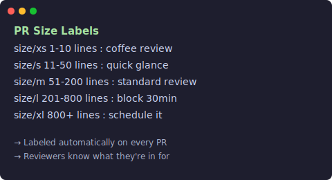

# PR Size Labeler

[](https://github.com/marketplace/actions/pr-size-labeler) [](LICENSE)

Labels every PR by how many lines it changes. XS / S / M / L / XL.

<p align="center">
  
</p>

---

## Setup

Add to `.github/workflows/pr-size.yml`:

```yaml
name: Label PR Size
on: [pull_request_target]

jobs:
  size-label:
    runs-on: ubuntu-latest
    permissions:
      pull-requests: write
      contents: read
    steps:
      - uses: neocrev/pr-size-labeler@v1
```

Every PR gets a `size/xs`–`size/xl` label automatically.

---

## Thresholds

| Label | Lines | Review time |
|-------|-------|-------------|
| size/xs | 1–10 | Coffee break |
| size/s  | 11–50 | Quick glance |
| size/m  | 51–200 | Standard |
| size/l  | 201–800 | Block 30 min |
| size/xl | 800+ | Schedule it |

---

## Customize

```yaml
- uses: neocrev/pr-size-labeler@v1
  with:
    xs-max: 10
    s-max: 50
    m-max: 200
    l-max: 800
    label-xs: "size/xs"
    label-s: "size/s"
    exclude-labels: "dependabot,automated"
    ignore-files: "*.lock,*.md,*.svg"
```

---

## License

MIT
